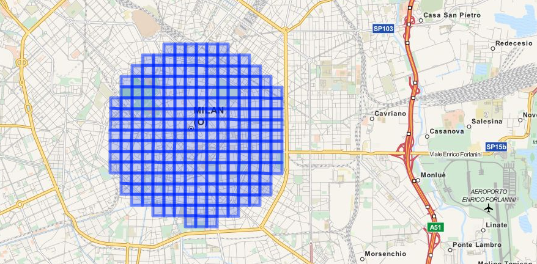
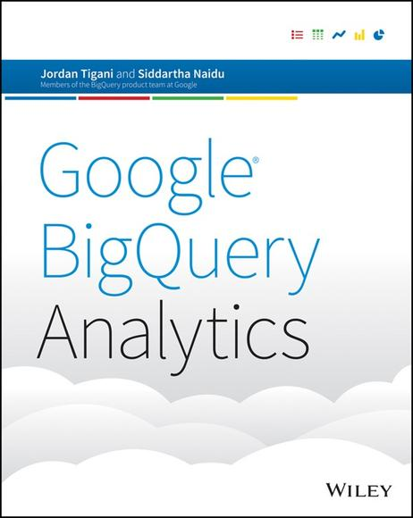

# Overview

- easy to use
- fully managed
- analytics engine
- for big data
- runs SQL queries
- fast
    - it doesn't matter what size of data
    - what type of queries you do
???
Thank you for joining us today!

no hardware, no virtual machines, no software to install
---
# BigQuery
- Analytics as a service
???
Your guess were correct
- I'm here to represent the Norwegian office of Nordcloud
- attila.babo@nordcloud.com
# Please raise your hand

- heard of BigQuery
- using analytics
    - SQL for analytics
    - BigQuery for analytics
---
# Goal

- practical introduction
- live demos
- hands-on experience using BigQuery
- enough information and a burning desire to try it at home
- this presentation is shared with you
- try it at home!

.footnote[http://hive.gl/BRQYQ]
???
- the power of curiosity
- please share it with your colleagues and like minded friends
---
# Does big data matter to me?

- more data than you can process in the amount of time you are willing to spend waiting for it
- ...amount of money...

# It's easy to get big data

- over time
- viral sharing
- project growth
- architectural limitations

???
- My current solution is fine
- I don't have petabyte scale problems
- I've checked it a few years back but it was too limited and pricey
- I'm not feeling safe to use it

I understand your concerns, please bear with us!
My personal goal is to address these.

- as the amount of data grows the amount of pain doing simple things like backup or schema changes are exponentially worse
- million records a day for years
- 10 actions from a million user per day
- business to business
- intense computation over your data like machine learning

---
# Demo to give an impression

    SELECT
      title,
      sum(views) as views
    FROM
      [bigquery-samples:wikimedia_pageviews.201207]
    GROUP EACH BY title
    ORDER BY views DESC
    LIMIT 100

.footnote[https://console.developers.google.com/project]
???

- show data size in GB and number of rows
- wiki 1
- cache off
- wiki 1
- wiki 2
- wiki 3
- show a mission impossible: effective regular expression in queries
---
## How to get my data in?

- anywhere -> Google Cloud Storage -> BigQuery Storage
???
- all these demos were against a public dataset
- to demo it with real data
- use a "small" CSV file from a public dataset
    - from my machine, using command line, explain while compress
    - start it, but have an uploaded copy to rescue
- explain the data flow: mac -> storage -> BigQuery table
- explain the content, data types
- create the table, if it arrived use it or the present copy
- .. This'll take a while, let's move on
---
# SMS, call, internet usage in Milano

.footnote[https://dandelion.eu/datagems/SpazioDati/telecom-sms-call-internet-mi/resource/]

???
- telecommunication activity over the city of Milano
- based on Call Detail Records (CDRs) generated by the Telecom Italia cellular network
- user activity for billing purposes and network management
    - incoming call
    - outgoing call
    - received SMS
    - sent SMS
    - internet traffic
- Internet: a CDR is generate each time
    a user starts an internet connection
    a user ends an internet connection
    during the same connection one of the following limits is reached:​
    15 minutes from the last generated CDR
    5 MB from the last generated CDR
Square id: the id of the square that is part of the Milano GRID; TYPE: numeric
Time interval: the beginning of the time interval expressed as the number of millisecond elapsed from the Unix Epoch on January 1st, 1970 at UTC. The end of the time interval can be obtained by adding 600000 milliseconds (10 minutes) to this value. TYPE: numeric
Country code: the phone country code of a nation. Depending on the measured activity this value assumes different meanings that are explained later. TYPE: numeric
SMS-in activity: the activity in terms of received SMS inside the Square id, during the Time interval and sent from the nation identified by the Country code. TYPE: numeric
SMS-out activity: the activity in terms of sent SMS inside the Square id, during the Time interval and received by the nation identified by the Country code. TYPE: numeric
Call-in activity: the activity in terms of received calls inside the Square id, during the Time interval and issued from the nation identified by the Country code. TYPE: numeric
Call-out activity: the activity in terms of issued calls inside the Square id, during the Time interval and received by the nation identified by the Country code. TYPE: numeric
Internet traffic activity: the activity in terms of performed internet traffic inside the Square id, during the Time interval and by the nation of the users performing the connection identified by the Country code . TYPE: numeric
---
# Analytics as we know it
- SQL is great
- indexes are great
- but
- there are known limitations
    - scaling up
    - asking a question you never asked before
    - running a query on the full dataset
???
- 100MB/sec for a hd
- limit could be memory size, disk space, available IO capacity or "just" money
- tuning a database for quick queries is an art
    - indexes
    - stripe data across disks
    - separate transaction logs
- full tables scans are daunting
- process it on an external system like Hadoop
---
# Solution
- scale out!
- started at Google by internal need
    - fast
    - scalable
    - managed
    - ad-hoc analytics
    - not just for your data scientist
- part of BigData stack 2.0
???
- how to read a terabyte in a second
---
# Current state
- affordable
- available for the general public
- open interfaces
    - REST, WebUI
- API with JSON data
    - Tableau, Excel, R, Pandas etc.
- flexible, multiple input sources
- data output
    - easy data management with ACL (Access Control List)
    - joined and shared datasets
- safe data storage
???
- started as an internal only product, one of the secret sauce of Google's success
- fully managed
- data is stored safely
- ODBC
- streaming injection, data is available immediately
- single namespace, join table from anywhere
- highly parallelized, compressed, replicated storage
- not just a throw away datastore
---
###Get a slice of a giant cluster of machines with guaranties rather than having a medium sized cluster
.right[*Jordan Tigani*]

???
.footnote[Use it, it's a competitive advantage!]
---
# How it works

???
- disk speed as bottleneck
- for a table scan a traditional DB reads the whole row
- in BigQuery the system loads data only what you are care about
- that speeds up lot of the queries
- queries come in through the root
- sharded and split at intermediate servers, they will do aggregation like grouping and ordering
- leaf nodes are thousands of machines, they do filtering, selection
- they read the columnar storage in prallel
- they do reductions all the way up

---
# Column oriented storage

???
- compressible, show it!
- read multiple copies in parallel
---
# SQL is cheap to parallelize but aggregation is complex
- it's feels like SQL, seems like SQL
    - many advantages
    - but it's different, some things are harder
        - distinct values are tricky
        - joins with large datasets are tricky
---
# Demo of a small dataset
???
- use webui
- move on from numbers, demo it with tableau
- switch to the full dataset
- move on from numbers, use an iPython notebook with Julia as backend with gadfly
- Excel, R
---
# Technical highlights
- fast, atomic imports
    - Cloud Storage
    - Hadoop
    - Google Cloud DataFlow
    - ODBC
- streaming injection API (100k rows/second per table)
- ETL (Extract, Transform, Load) operations inside BigQuery
    - deduplication
- exports
    - Hadoop
- a rich SQL language
    - extends with nested and repeated fields
    - JSON queries
    - raw JSON fields
    - JSON path type queries
    - IP address parsing
    - regular expressions
- web console, connectors for R, iPython, Pandas, Excel
???
- these are expensive in a normal relational database that has indices
- large, multi-tenant (shared) computer cluster
---
# Import, export, storage pricing
- loading data into BigQuery is free
- streaming live data into BigQuery
    - 2.6 GB data for 1 NOK *from August 12, 2015*
- storing data
    - 1 GB of data is 0.15NOK per month
- exporting data
    - free

# Query Pricing
- 1TB of total data processed is 37.65 NOK
.footnote[$1 is 7.53NOK]
???
- based on total data processed
    - charged according to the total data processed in the columns you select
    - the total data per column is calculated based on the types of data in the column
- streaming is row based
- the first 1 TB of data processed per month is free
- queries that return an error, or for cached queries

- stream $0.01 per 200 MB, 1 KB minimum size
- storage 2 cent
- query $5
- per day
- you are paying for the data touched during the query
---
# Demo with a large dataset
???
- NYC taxi rides from 2010-2013
- 120GB of uncompressed data
- data fields, geolocation
- how to move that in?
- simple queries
- there are errors inside!
- find errors
- eliminate them
- complex queries with output on the map
---
# How to start with BigQuery?
- there is a campaign * use your private gmail *
    - free usage up to $300 for max two month
- prefect way to safely experiment and get a feeling about the service
    - including the cost structure

# How can Nordcloud help?
- advisory, consulting, knowledge transfer
- integration
- performance, architecture and cost optimization
- 24/7 operation duty
- we are Google's only premium consulting partner in the Nordics
---
class: middle

#I look forward to hearing from you
.right[*attila.babo@nordcloud.com*]
.footnote[http://hive.gl/BRQYQ]
???
# Try it at home!
- this presentation is shared with you
- try it at home!
- When you see the value that BigQuery gives you, please contact Nordcloud and we will help you set up an account where you will get a monthly invoice from us in NOK
- buy Google Cloud services through Nordcloud
- we invoice it in NOK
---
# 

- experts in migration, automation and management of modern cloud infrastructure
- provide advisory, consulting, training and 24/7 operation duty for cloud computing services
- over two hundred projects in a wide range of industry sectors
- headquartered in Helsinki the company is growing rapidly, in the Nordics and beyond
