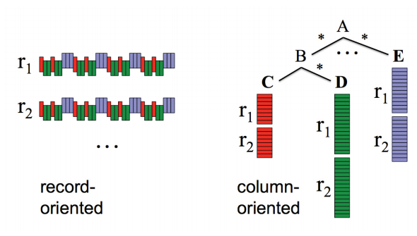

# Overview

- an analytics engine
- for big data
- runs SQL queries
- fast
    - it doesn't matter what size of data
    - what type of queries you do
- easy to use
- no administration or provisioning
???
no hardware, no virtual machines, no software installation
---
# BigQuery
???
Your guess were correct
- I'm here to represent the Norwegian office of Nordcloud
- attila.babo@nordcloud.com
# Please raise your hand

- heard of BigQuery
- using analytics
    - SQL for analytics
    - BigQuery for analytics
---
# Goal

- practical introduction
- live demos
- hands-on experience using BigQuery
- enough information and a burning desire to try it at home
- to share it with your colleagues and like minded friends
- this presentation is shared with you
- try it at home!

.footnote[http://hive.gl/BRQYQ]
---
# Does BigQuery matter to me?

- I don't have petabyte scale problems
- my current solution is fine
- I've checked it a few years back but it was too limited and pricey
- I'm not feeling safe to use it
???
I understand your concerns, please bear with us!
My personal goal is to address these.
---
# Demo to give an impression
- 1m rows
- cache off
- 1m rows
- 100m rows
- show a mission impossible: effective regular expression in queries
---
## How to get my data in?

- anywhere -> Google Cloud Storage -> BigQuery table
???
- all these demos were against a public dataset
- to demo it with real data
- use a "small" CSV file from a public dataset
    - from my machine, using command line, explain while compress
    - start it, but have an uploaded copy to rescue
- explain the data flow: mac -> storage -> BigQuery table
- explain the content, data types
- create the table, if it arrived use it or the present copy
- .. This'll take a while, let's move on
---
# Telecommunications - SMS, Call, Internet usage in Milano
.footnote[https://dandelion.eu/datagems/SpazioDati/telecom-sms-call-internet-mi/resource/]
---
# Background
- SQL is great
- indexes are great
- but
- tables scans are daunting
- scaling up solutions are limited
---
# Solution
- scale out!
- started at Google by internal need
    - fast
    - scalable
    - managed
    - ad-hoc analytics
    - not just for your data scientist
- analytics as a service
???
- limit could be memory size, disk space, available IO capacity or "just" money
---
# Current state
- vastly improved
- available for the general public
- affordable
- API with JSON data
- with open interfaces
    - REST, WebUI, ODBC
- flexible, multiple input sources
    - streaming injection, data is available immediately
- data output
    - tableau, etc. RE
    - Excel RE
    - easy data management with ACL (Access Control List)
    - joined and shared datasets
- highly parallelized, compressed, replicated storage RE
???
- started as an internal only product, one of the secret sauce of Google's success
- fully managed
- data is stored safely
- single namespace, join table from anywhere
---
.footnote[Use it, it's a competitive advantage!]
.Aligner-item[###Get a slice of a giant cluster of machines with guaranties rather than having a medium sized cluster]

.right[*Jordan Tigani*]
???
Book cover
---
# How it works

???
- disk speed as bottleneck
---
# Column oriented storage

???
- compressible, show it!
- read multiple copies in parallel
---
# SQL is cheap to parallelize but aggregation is complex
- it's feels like SQL, seems like SQL
    - many advantages
    - but it's different, some things are harder
        - distinct values are tricky
        - joins with large datasets are tricky
---
# Demo of a small dataset
???
- use webui
- move on from numbers, demo it with tableau
- switch to the full dataset
- move on from numbers, use an iPython notebook with Julia as backend with gadfly
- Excel, R
---
# Technical highlights
- fast, atomic imports
    - Cloud Storage
    - Hadoop
    - Google Cloud DataFlow
    - ODBC
- streaming injection API (100k rows/second per table)
- ETL (Extract, Transform, Load) operations inside BigQuery
    - deduplication
- exports
    - Hadoop
- a rich SQL language
    - extends with nested and repeated fields
    - JSON queries
    - raw JSON fields
    - JSON path type queries
    - IP address parsing
    - regular expressions
- web console, connectors for R, iPython, Pandas, Excel
???
- these are expensive in a normal relational database that has indices
- large, multi-tenant (shared) computer cluster
---
# Import, export, storage pricing
- loading data into BigQuery is free
- streaming live data into BigQuery
    - 2.6 GB data for 1 NOK *from August 12, 2015*
- storing data
    - 1 GB of data is 0.15NOK per month
- exporting data
    - free

# Query Pricing
- 1TB of total data processed is 37.65 NOK
.footnote[$1 is 7.53NOK]
???
- based on total data processed
    - charged according to the total data processed in the columns you select
    - the total data per column is calculated based on the types of data in the column
- streaming is row based
- the first 1 TB of data processed per month is free
- queries that return an error, or for cached queries

- stream $0.01 per 200 MB, 1 KB minimum size
- storage 2 cent
- query $5
- per day
- you are paying for the data touched during the query
---
# Demo with a large dataset
- NYC taxi rides from 2010-2013
- 120GB of uncompressed data
???
- data fields, geolocation
- how to move that in?
- simple queries
- there are errors inside!
- find errors
- eliminate them
- complex queries with output on the map
---
# How to start with BigQuery?
- there is a campaign * use your private gmail *
    - free usage up to $300 for max two month
- prefect way to safely experiment and get a feeling about the service
    - including the cost structure

# How to continue?
- Nordcloud is here to help
- advisory, consulting and 24/7 operation duty
- We are Google's only premium consulting partner in the Nordics
---
class: middle

#I look forward to hearing from you
.right[*attila.babo@nordcloud.com*]
.footnote[http://hive.gl/BRQYQ]
???
# Try it at home!
- this presentation is shared with you
- try it at home!
- When you see the value that BigQuery gives you, please contact Nordcloud and we will help you set up an account where you will get a monthly invoice from us in NOK
- buy Google Cloud services through Nordcloud
- we invoice it in NOK
---
# 

- experts in migration, automation and management of modern cloud infrastructure
- provide advisory, consulting, training and 24/7 operation duty for cloud computing services
- over two hundred projects in a wide range of industry sectors
- headquartered in Helsinki the company is growing rapidly, in the Nordics and beyond
