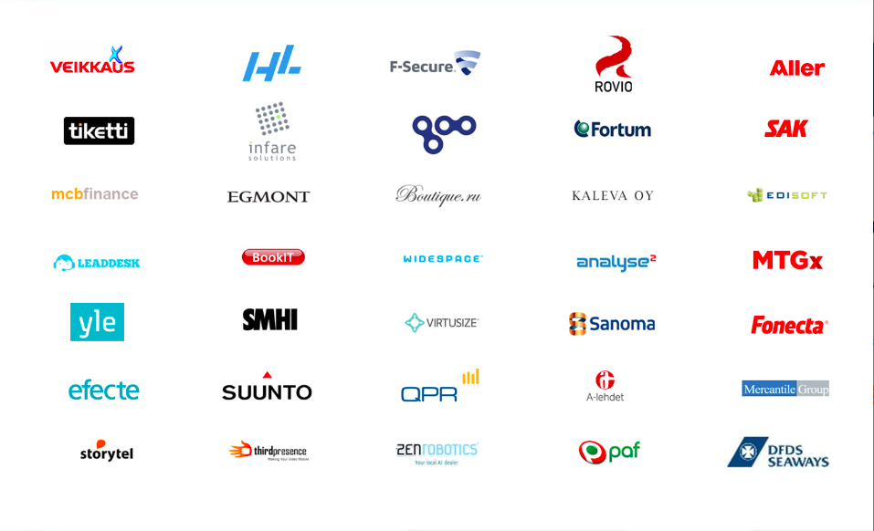

# Overview

- a big data analytics engine
- run SQL queries over the cloud on your data
- it doesn't matter what size of data
- what type of queries you do
- it's easy to use
- with open interfaces, REST, WebUI, ODBC
- fully managed
- blazingly fast
- with ~SQL interface
- petabyte scale
- easy data management with ACL (Access control list)
- fast, atomic imports
- no administration or provisioning
- analytics as a service
- BigQuery, your guess was correct

---
# Goal

- give you a hands on experience about BigQuery
- live demo
- a practical introduction
- enough information and a burning desire to try it at home
- to share it with your colleagaues and like minded friends
- this presentation is shared with you
- try it at home!

.right[https://these_slides.to.download]
---
# Nordcloud

- experts in migration, automation and management of modern cloud infrastructure
- provide advisory, consulting, training and 24/7 operation duty for cloud computing services
- over two hundred projects in a wide range of industry sectors
- headquartered in Helsinki the company is growing rapidly, in the nordics and beyond
- I'm here to represent the Norwegian office of Nordcloud
- attila.babo@nordcloud.com

.left[]

### Please raise your hand

- heard of BigQuery
- using analytics
- SQL for analytics
- BigQuery for analytics

.right[https://these_slides.to.download]

---
# Demo with a public dataset to show the speed
- 1m rows
- cache off
- 1m rows
- 100m rows
- 10000m rows
- show regexp, mission impossible
---
# How to start?
- use your private gmail with the 300USD for two month credit
- add billing, this is required but doesn't cost you within the credit
- prefect way to safely experiment and get a feeling about the service
    - including the cost

# How to continue
- buy it from nordcloud
- we invoice it in NOK
---
## Dataflow
- use a "small" CSV file from a public dataset
    - from my machine, using command line, explain while compress
    - start it, but have an uploaded copy to rescue
- explain the data flow: mac -> storage -> BQ table
- explain the content, data types
- create the table, if it arrived use it or the present copy
- .. this takes a while so we move on
---
# Does BigQuery matters to me?

- I don't have petabyte scale problems
- my current solution is fine
- I've checked it a few years back but it's too limited and pricey

---
# Background
- SQL is great
- indexes are great
- but
- tables scans are daunting
- scaling out, instead of scaling up
- started early at google by internal need
    - fast
    - scaleable
    - ad-hoc analytics
    - not just for your data scientist
- vastly improved
---
# current state
- available for the general public
- constantly improving
- affordable
- API with JSON data, sounds familiar?
- flexible, multiple input sources
- joined and shared datasets
- web console, connectors to R, Pandas, Hadoop, ODBC
- streaming injection, data is available immediately
- get a slice of a giant cluster of machines with guaranties rather than having a medium sized cluster

### use it, it's a competitive advantage
---
# Price
- price model
- current figures in NOK
---
# demo of the small dataset
- use webui
- move on from numbers, use an ipython notebook with Julia as backend with gadfly
---
# How it works
- disk speed as bottlenneck
- show a diagram of BQ
- column oriented storage
    - compressible, show it!
    - read multiple copies in parallel
- SQL is cheap to paralleize but aggregation is complex
    - distinct values are tricky
    - joins with large datasets are tricky
    - it's feels like SQL, seems like SQL
        - many advantages
        - but it's different
        - some things are harder, examples above
---
# Demo with large dataset
- NYC taxi rides from 2010-2013
- 120GB of uncompressed data
- data fields, geolocation
- how to move that in?
- simple queries
- there are errors inside!
- find errors
- eliminate them
- complex queries with output on the map
---

- attila.babo@nordcloud.com
- this presentation is shared with you
- try it at home!

.right[https://these_slides.to.download]
